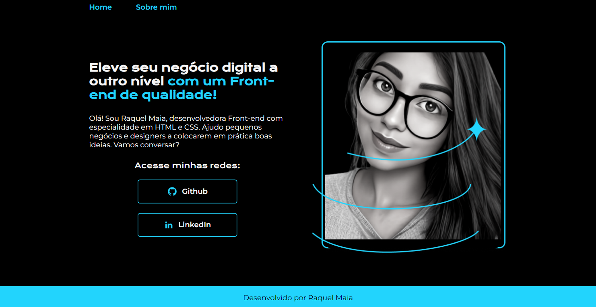

# Olá, Seja bem-vindo ao meu projeto de portfólio feito com o curso da Alura.



##  Fiz algumas alterações


## Ferramentas utilizadas:

* HTML

* CSS

* Flex-box

## Feito por:

### Raquel Maia

### Linkedin: https://www.linkedin.com/in/raquel-maia-860/
### Link do projeto finalizado:  https://raquel-maia.github.io/portfolio/

```


